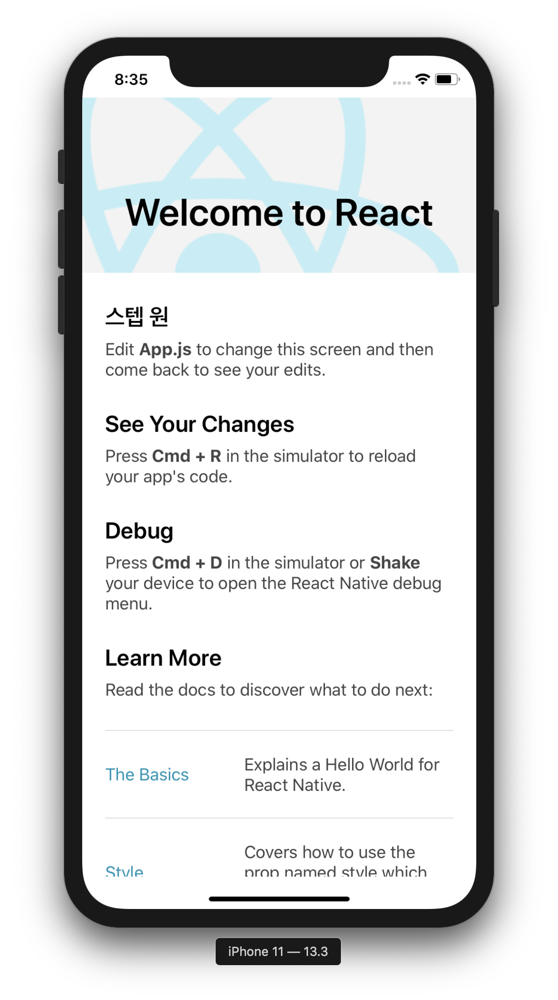

개발 환경 설정
======================
리액트 네이티브 앱을 개발하기 위한 환경을 구축합니다.

이 문서는 맥 OSX 10.14.6 환경에서 작성되었습니다.

## iOS 개발 준비물 설치하기

- Node & Watchman
- Xcode & CocoaPods
- React Native Command Line Interface

모바일을 처음 개발하는 개발자라면 Expo CLI를 이용하여 쉽게 시작할 수 있다고 합니다. 많은 [기능](https://expo.io/features) 들을 제공하고 Nods.js와 폰 또는 에뮬레이터만 있으면 쉽게 몇분안에 쉽게 시작할 수 있고, [Snack](https://snack.expo.io) 이라는 웹 에디터를 이용해 툴을 설치하기 전에 미리 해볼 수 있습니다.

모바일 개발에 익숙하다면 React Native CLI를 사용하는 것이 좋다고 합니다. Xcode 또는 Android Studio가 필요합니다.

여기서는 React Native CLI를 이용해 보겠습니다.

## 1. Node & Watchman 설치

brew를 이용해 설치를 진행합니다.

brew는 맥에서 사용하는 패키지 관리자로 [Homebrew](https://brew.sh/index_ko)에서 설치 스크립트를 이용해 설치하시면 됩니다.

```
brew install node
brew install watchman
```

[Watchman](https://facebook.github.io/watchman)은 페이스북에서 만든 filesystem의 변경사항을 감시하는 툴입니다.

여기서는 코드가 변경되는걸 감지하고 화면을 변경해주기 위한 용도로 사용될 것 같습니다. 

웹 개발시에 사용하는 livereload와 같은 역할일 것 같습니다.

## 2. Xcode & CocoaPods 설치

Xcode는 맥 [앱스토어](https://docs.google.com/spreadsheets/d/1OfI2jw7-CFKnA3HZIdD737OUq8cCUAIUP8uhq6y_nvA/edit#gid=0)에서 설치하면 됩니다. 설치시에 iOS 시뮬레이터와 iOS 앱을 빌드하기 위한 도구들이 같이 설치됩니다.

Xcode는 9.4버전 이상이 필요합니다. 현재 제가 설치된 버전은 11.3.1입니다.

Xcode가 설치되면 Xcode CLI(Command Line Interface)를 설치해줍니다. 

Xcode를 실행한 후 Preferences(단축키 커맨드 + ,)로 들어간 후 Locations 패널에서 Command Line Tools을 최신 버전으로 선택해줍니다.


iOS 시뮬레이터는 Components 패널에서 사용 원하는 버전을 설치하시면 됩니다.


[CocoaPods](https://cocoapods.org)는 Swift나 Objective-C 프로젝트에 사용하는 디펜던시 매니저입니다. .NET의 NuGet 처럼 패키지를 다운받을 수 있습니다. 

맥에 기본으로 설치된 루비로 이용할 수 있으며 다음의 명령어로 설치할 수 있습니다.

```
sudo gem install cocoapods
```

더 자세한 정보를 원하면 [여기](https://guides.cocoapods.org/using/getting-started.html)를 참조하세요.

## 3. React Native Command Line Interface

리액트 네이티브는 cli(command line interface)를 내장하고 있습니다. 특정 버전의 cli를 전역에서 사용할 수 있도록 설치할 수 있지만(npm install -g react-native-cli), npx를 이용해 현재 최신버전을 실행하는 것을 추천합니다. npx react-native <명렁어>를 이용하면 현재 안정적인 버전의 CLI를 다운로드하고 실행할 것입니다.

* npx도 하나의 모듈이며 npm 5.2버전부터 기본 패키지로 제공된다. npm을 이용해 전역으로 설치할 경우, 모듈 업데이트 확인 문제, 여러 프로젝트에 전역 모듈을 같이 사용하므로 모듈이 업데이트 됐을 때 생기는 문제 등있다. 따라서 버전이 자주 바뀌는 등의 패키지에는 npx를 이용하여 현재 최신버전을 다운로드해 사용하고 다시 없어지는 방식을 사용하는 것이 좋습니다.

## 리액트 프로젝트 생성하기

react-native cli를 이용하여 새로운 프로젝트를 생성할 수 있습니다. "example"라는 프로젝트를 만들어 보겠습니다.

```
npx react-native init exampel
```

특정 버전의 react native를 사용하고 싶으면 --versino 옵션을 이용합니다.

```
npx react-native init example --version X.XX.X
```

또한 타입스크립트 같이 커스텀 리액트 네이티브 템플릿으로 프로젝트를 시작하고 싶으면 --template 옵션을 이용합니다.

```
npx react-native init AwesomeTSProject --template react-native-template-typescript
```

위의 명렁어가 실패하면 아마도 구 버전의 react-native나 react-native-cli가 전역으로 설치되어있을 거라네요. 지우고 npx로 다시 실행하세요.

## 리액트 네이티브 애플리케이션 실행하기

### 1. Metro 실행하기

먼저 리액트 네이티브와 함께 제공되는 자바스크립트 번들러인 Metro를 실행합니다. Metro는 "입력 파일과 다양한 옵션을 이용해 모든 코드와 종속성을 포함하는 단일 자바스크립트 파일을 생성합니다. [Metro 문서](https://facebook.github.io/metro/docs/concepts)

* 문서와 바뀐 것인지 모르겠지만 2번의 run-ios를 실행하면 메트로가 자동으로 시작됩니다.

### 2. iOS 앱 실행하기

Metro 번들러를 실행하였으면, 새로운 터미널을 실행한 후 리액트 네이티브 프로젝트 폴더에서 다음 명령어를 실행한다.(바로 위에서도 얘기했지만 아래의 명령어만 실행해도 새로운 터미널에서 Metro가 실행됩니다.)

```
npx react-native run-ios
```

iOS 시뮬레이터가 실행되면서 새로운 앱이 실행됩니다.


npx react-native run-ios는 앱을 실행하는 한가지 방법이며 Xcode에서 직접 실행할 수도 있습니다.

### 3. 앱 수정해 보기

앱이 성공적으로 실행되었다면, 아무 에디터로 프로젝트 폴더의 ```App.js```를 열어 수정해봅니다.


iOS 시뮬레이터에서 커맨드 + R 키를 누르면 변경된 내용을 확인할 수 있습니다.
(Watchman을 설치하였다면 자동으로 갱신됩니다.)

