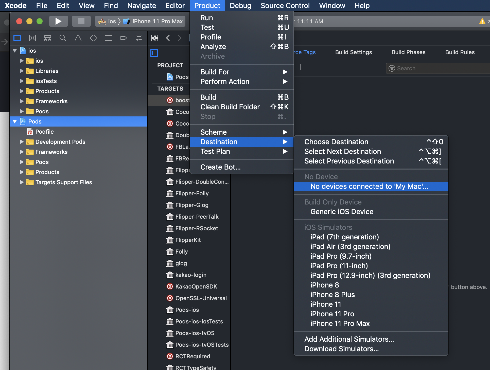
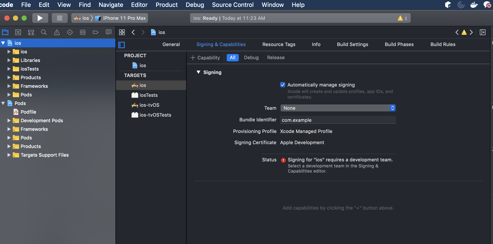
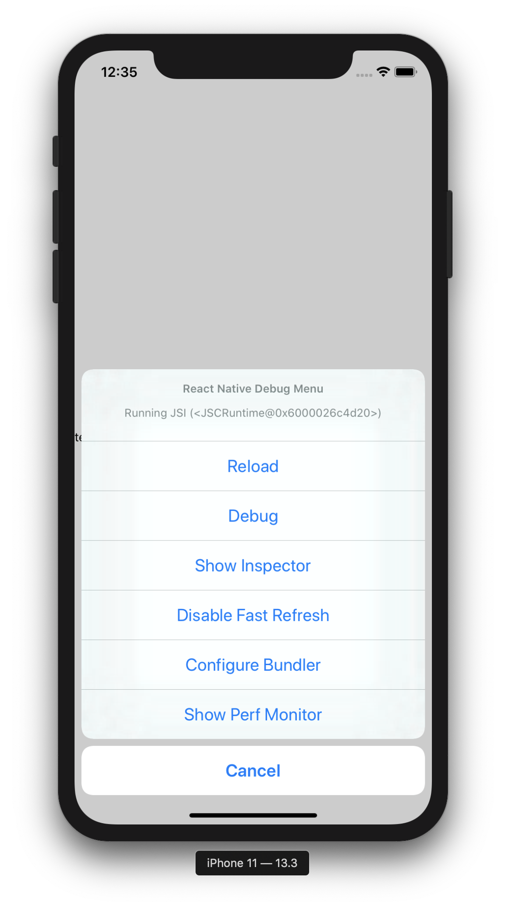

디바이스에서 실행하기
======================

앱을 출시하기전에 디바이스에서 실행해 보는 것이 좋습니다.

Expo CLI 또는 Create React Native App을 이용해 프로젝트를 만든 경우 Expo 앱으로 QR코드를 스캔하여 기기에서 앱을 미리 볼 수 있지만 앱을 빌드하여 기기에서 실행하려면 프로젝트를 ```eject``` 한 후 [1. 개발환경설정](1.%20Environment.md) 를 통해 네이티브 코드 디펜던시를 설치해야 합니다.

## 1. 아이폰 디바이스를 맥에 연결하세요

USB to 라이트닝 케이블을 이용해 맥에 iOS 디바이스를 연결하세요. 프로젝트 폴더 안의 ios 폴더에서 .xcodeproj 파일을 엽니다. Xcode로 프로젝트가 열립니다. 또한 CocoaPods를 이용하고 있으면 .xcworkspace 열면 Xcode에서 이용할 수 있습니다.

iOS 디바이스에서 앱을 처음 실행하는 경우 개발을 위해 기기를 등록해야 합니다. Xcode의 메뉴에서 Product > Destination의 목록에서 연결된 디바이스를 선택하면 Xcode가 개발용 디바이스로 등록할 것 입니다. (아이폰이 없습니다...)



## 2. 코드 서명 설정

아직 [애플 개발자 계정](https://developer.apple.com)이 없다면 등록해야 합니다. (애플 개발자 프로그램은 1년에 $99이므로 가입시 결제가 되는지 주의하세요. 저는 카드번호 입력에서 취소했습니다....)

Xcode 좌측의 네비게이터에서 프로젝트를 선택한 후 Signing & Capabilities 탭으로 이동합니다. (XCode에 따라 Signing이 General 탭에 있을 수도 있습니다.)

Team 선택에서 애플 개발자 계정을 연결하시고 Bundle Identifier에 프로젝트를 구분할 이름을 넣습니다. 좌측 TARGETS의 xxxTests 항목도 동일하게 설정합니다.



설정이 올바르게 되었으면 디바이스가 Xcode 툴바의 빌드 타겟에 나타날 것이며 디바이스 패널(커맨드 + 쉬프트 + 2)에도 나타날 것입니다.

이제 Product 메뉴의 Run을 누르거나(커맨드 + R) Xcode 툴바의 실행을 누르면 디바이스에서 앱이 실행될 것입니다.

## 개발 서버에 접속하기

디바이스가 맥과 같은 와이파이에 접속되어 있다면, 개발 서버에 접속하여 빠르게 실행해 볼 수 있습니다. 디바이스를 흔들면(에뮬레이터에서는 Hardware > Shake Gesture) 개발자 메뉴를 열 수 있습니다. 개발자 메뉴에서 실시간 갱신(Live Reload)를 설정할 수 있습니다. 자바스크립트 코드가 변경될 때마다 앱이 갱신될 것 입니다.



## Troubleshooting

## 프로덕션 앱으로 빌드